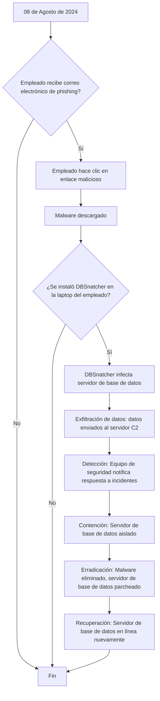

**INFORME DE INCIDENTE DE SEGURIDAD**
===========================================================

### Introducción
Este informe se realizó el 09/08/2024 en respuesta a un incidente de seguridad que afectó la plataforma de garras y tuercas poniendo en riesgo el funcionamiento y la integridad de la plataforma atraves de una 

### Fecha de Informe:
09/08/2024

### PERSONA DE CONTACTO
----------------------

* **Nombre Completo:** Sebastian Avila
* **Dirección:** Garras y Tuercas HQ
* **Título del Puesto:** Experto en ciberseguridad
* **Teléfono:** (+569) 99999999
* **Correo Electrónico:** Elseguro@gmail.com

### EL INCIDENTE
----------------

* **Fecha del Incidente:** 08/08, 2024
* **Hora:** 10:30 [x] AM [ ] PM
* **Tipo de Incidente:** [x] Malware [x] Brecha de Datos [ ] Otro: Troyano con spyware
* **¿Cómo se detectó/descubrió el incidente?:** Se alertó a través de antivirus y escaneo de redes.

### NOTIFICACIÓN
----------------

* **¿Se notificó a otros empleados?:** [x] Sí [ ] No
* **Sí sí, ingrese:** Se informó al equipo de seguridad.

### CONTENCIÓN
----------------

* **¿Se tomaron medidas de contención?:** [x] Sí [ ] No
* **Si sí, describa:** Se realizaron escaneos en busca de virus y se cerraron las conexiones salientes a dispositivos identificados robando información.

### SERVICIOS AFECTADOS
----------------------

* **¿Se vio afectado permanentemente algún servicio por el incidente?:** [x] Sí [] No
* **Si sí, describa:** Se tuvo que detener el servicio de la página ya que nueva información ingresada podría ser vulnerada y no se volvió a subir hasta que se soluciono la vulneración.

-----------------------------------------------------------

### VECTOR DE ATAQUE
-----------------

* **¿Sabe cómo se realizó el ataque?:** [x] Sí [ ] No
* **Si sí, describa:** Se ejecutó un archivo pdf que venía con un troyano el cual fue usado como entrada para el payload que sería el spyware.

### IMPACTO DE LA INFORMACIÓN
----------------------

* **¿Se vio comprometida alguna información, registro o dato?:** [x] Sí [ ] No
* **Si sí, describa:** Posible alteración o filtración de información personal desde la base de datos.

### OTROS
---------

* **¿Hay alguna otra información que desee incluir en este informe?:** [x] Sí [ ] No
* **Si sí, describa:** Este incidente puede traer repercusiones legales que pueden afectar de forma negativa a la empresa, Se realizará una investigación para buscar qué información fue filtrada para poder mitigar en lo máximo posible el posible daño que se pueda hacer con esta información.

### USO EXCLUSIVO DE LA OFICINA
-------------------

* **Informe recibido por:** Christofer Espinoza
* **Fecha:** 09/08, 2024
* **Acción de seguimiento tomada:** Se realizó un backup a un punto donde no se había vulnerado el sistema y se hicieron extensos escaneos en búsqueda de intrusos en la red y se aplicaron nuevos parámetros en el firewall para prevenir futuros ingresos de este trojano.

* **Vector Inicial:** Un correo electrónico de phishing fue enviado a un empleado, quien hizo clic en un enlace malicioso, descargando el malware DBSnatcher en su laptop.

* **Movimiento Lateral:** El malware se propagó al servidor de base de datos a través de una cuenta de servicio vulnerable.

* **Exfiltración de Datos:** El malware exfiltró datos confidenciales de clientes, incluyendo nombres, direcciones y números de tarjeta de crédito, al servidor C2 remoto.

* **Detección:** Nuestro equipo de seguridad detectó el malware utilizando herramientas de detección de anomalías y notificó al equipo de respuesta a incidentes.

* **Contención:** El servidor de base de datos fue aislado para prevenir la exfiltración de datos adicionales.

* **Erradicación:** El malware fue eliminado y el servidor de base de datos fue parcheado para prevenir la re-infección.

* **Recuperación:** El servidor de base de datos fue restaurado y se realizaron copias de seguridad de datos.

### Recomendaciones

* implementar medidas de seguridad adicionales para prevenir el movimiento lateral, como segmentación de red y endurecimiento de cuentas de servicio.

* Mejorar la conciencia de seguridad de los empleados para prevenir ataques de phishing.

* Realizar evaluaciones de vulnerabilidad y pruebas de penetración regulares para identificar posibles puntos de entrada para malware.

### Próximos Pasos

* Realizar un análisis post-mortem exhaustivo de la respuesta a incidentes para identificar áreas de mejora.

*Notificar a los clientes afectados y proporcionar servicios de monitoreo de crédito.

*Revisar y actualizar los procedimientos de respuestas a incidentes para asegurar una respuesta oportuna efectiva a futuros incidentes.